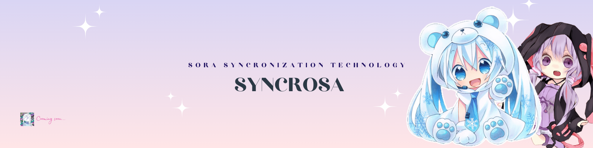

Syncrosa is an entertainment and technology company that brings the best experience to fans of anime and Japanese culture. As an anime-only microblogging platform, we provide a comprehensive online environment, connecting fans with the world of anime, manga, reels, Vtuber and cosplay communities. With features such as anime microblogging, in-depth information about anime and manga, and support for creativity through reels, Syncrosa is a gathering place for an active and participating community, and provides a place for users to explore, interact and participate in various aspects of the Japanese entertainment industry. We are committed to maintaining content quality, promoting inclusivity, and contributing to the positive growth of the Japanese entertainment industry.
